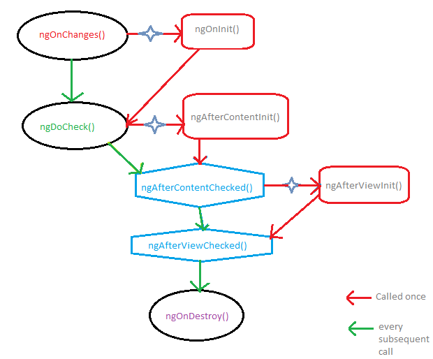

## [Life-cycle](https://angular.dev/guide/components/lifecycle)

| **Phase**               | **Method**              | **Summary**                                                                                                                                                                    |
| ----------------------- | ----------------------- | ------------------------------------------------------------------------------------------------------------------------------------------------------------------------------ |
| Creation                | `constructor`           | [Standard JavaScript class constructor](https://developer.mozilla.org/en-US/docs/Web/JavaScript/Reference/Classes/constructor) . Runs when Angular instantiates the component. |
| Change  Detection | `ngOnInit`              | Runs once after Angular has initialized all the component's inputs.                                                                                                            |
|                         | `ngOnChanges`           | Runs every time the component's inputs have changed.                                                                                                                           |
|                         | `ngDoCheck`             | Runs every time this component is checked for changes.                                                                                                                         |
|                         | `ngAfterViewInit`       | Runs once after the component's _view_ has been initialized.                                                                                                                   |
|                         | `ngAfterContentInit`    | Runs once after the component's _content_ has been initialized.                                                                                                                |
|                         | `ngAfterViewChecked`    | Runs every time the component's view has been checked for changes.                                                                                                             |
|                         | `ngAfterContentChecked` | Runs every time this component content has been checked for changes.                                                                                                           |
| Rendering               | `afterNextRender`       | Runs once the next time that **all** components have been rendered to the DOM.                                                                                                 |
|                         | `afterRender`           | Runs every time **all** components have been rendered to the DOM.                                                                                                              |
| Destruction             | `ngOnDestroy`           | Runs once before the component is destroyed.                                                                                                                                   |

### [Life-cycle hooks](https://github.com/angular/angular/blob/main/aio/content/guide/lifecycle-hooks.md)

* Component instance has life-cycle hooks which can help you to hook into different events on Components.
* Life-cycle ends when components are destroyed.
* The sequence of log messages follows the prescribed hook calling order:

Angular executes hook methods in the following sequence. Use them to perform the following kinds of operations.

|Hook method|Purpose|Timing|
|:--|:--|:--|
|`ngOnChanges()`|Respond when **Angular sets or resets data-bound input properties.** The method receives a `SimpleChanges` object of current and previous property values.    **NOTE**:   This happens frequently, so any operation you perform here impacts performance significantly. **Changes should be in memory, if the change point to same memory in JS, changes will not be detected.**  See details in [Using change detection hooks](https://github.com/angular/angular/blob/main/aio/content/guide/lifecycle-hooks.md#onchanges) in this document. |Called before `ngOnInit()` (if the component has bound inputs) and whenever one or more data-bound **input properties change** `@Input`.    **NOTE**:   If your component has no inputs or you use it without providing any inputs, the framework will not call `ngOnChanges()`. |
|`ngOnInit()`|Initialize the directive or component after Angular first displays the data-bound properties and sets the directive or component's input properties. **Runs after the Constructor.** See details in [Initializing a component or directive](https://github.com/angular/angular/blob/main/aio/content/guide/lifecycle-hooks.md#oninit) in this document. |Called once, after the first `ngOnChanges()`. `ngOnInit()` is still called even when `ngOnChanges()` is not (which is the case when there are no template-bound inputs).|
|`ngDoCheck()`|Detect and act upon changes that Angular can't or won't detect on its own. See details and example in [Defining custom change detection](https://github.com/angular/angular/blob/main/aio/content/guide/lifecycle-hooks.md#docheck) in this document.|Called immediately after `ngOnChanges()` on every change detection run, and immediately after `ngOnInit()` on the first run.|
|`ngAfterContentInit()`|Respond after Angular projects external content into the component's view, or into the view that a directive is in.   See details and example in [Responding to changes in content](https://github.com/angular/angular/blob/main/aio/content/guide/lifecycle-hooks.md#aftercontent) in this document.|Called _once_ after the first `ngDoCheck()`.|
|`ngAfterContentChecked()`|Respond after Angular checks the content projected into the directive or component.   See details and example in [Responding to projected content changes](https://github.com/angular/angular/blob/main/aio/content/guide/lifecycle-hooks.md#aftercontent) in this document.|Called after `ngAfterContentInit()` and every subsequent `ngDoCheck()`.|
|`ngAfterViewInit()`|Respond after Angular initializes the component's views and child views, or the view that contains the directive.   See details and example in [Responding to view changes](https://github.com/angular/angular/blob/main/aio/content/guide/lifecycle-hooks.md#afterview) in this document.|Called _once_ after the first `ngAfterContentChecked()`.|
|`ngAfterViewChecked()`|Respond after Angular checks the component's views and child views, or the view that contains the directive.|Called after the `ngAfterViewInit()` and every subsequent `ngAfterContentChecked()`.|
|`ngOnDestroy()`|Cleanup just before Angular destroys the directive or component. Unsubscribe Observables and detach event handlers to avoid memory leaks. See details in [Cleaning up on instance destruction](https://github.com/angular/angular/blob/main/aio/content/guide/lifecycle-hooks.md#ondestroy) in this document.|Called immediately before Angular destroys the directive or component.|

* VID 4:46:00 to 6:50:00

