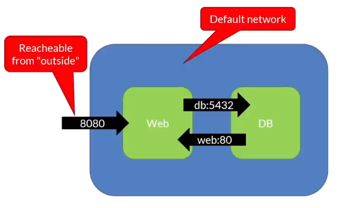
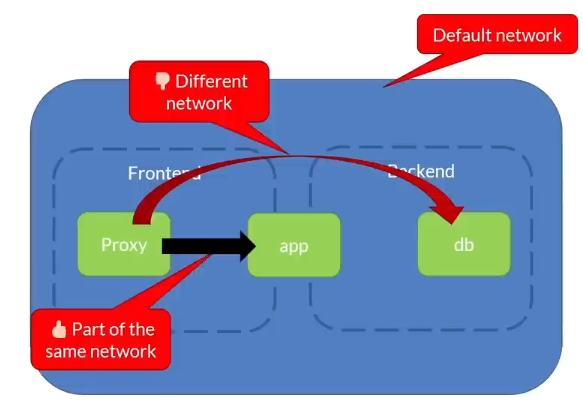

`docker-compse` command is version 1 of the plugin, and is depricated.
`docker compse` is the new plugin comes pre-bundled with the docker.

The Docker Compose file `docker-compose.yml` or `compose.yml` must be in same folder.
Will by default **use folder name, has the compose name.**
**Volumes created by *compose*  are not deleted by compose, should be manually deleted**

COMMAND | DESCRIPTION
---|---
`docker compose build`| Build the image (needs `Dockerfile`)
`docker compose start` | Start containers
`docker compose stop` | Stop containers
`docker compose up -d` | Build and start
`docker compose ps`  | List what's running
`docker compose rm`  | Remove from memory
`docker compose down`  | Stop and remove
`docker compose logs`  | Get the logs
`docker compose exec [container] bash`  | Run a command in a container
`docker compose logs -f [contianer]`  | Get the logs from container

COMMAND | DESCRIPTION
---|---
`docker compose --project-name test1 up -d` | Run additional instance of already running instance
`docker compose -p test2 up -d` | Shortcut
`docker compose -p test2 down` | To down the instance
`docker compose ls` | List running projects
`docker compose cp [containerID]:[SRC_PATH] [DEST_PATH]` | Copy files from the container
`docker compose cp [SRC_PATH] [containerID]:[DEST_PATH]` | Copy files to the container

```
App
 |_frontend
   |_Dockerfile
 |_backend
   |_Dokerfile
```

```yml
services: # list of container to be deployed
  backend:
    build: # buid an image using the code
      args:
      - NODE_ENV=development
      context: backend # Dockerfile is located in the backend folder
    command: npm run start-watch
    environment:
      - DATABASE_DB=example
      - DATABASE_USER=root
      - DATABASE_PASSWORD=/run/secrets/db-password
      - DATABASE_HOST=db
      - NODE_ENV=development
    ports:
      - 3001:80
      - 9229:9229
      - 9230:9230
    secrets:
      - db-password
    volumes:
      - ./backend/src:/code/src:ro
      - ./backend/package.json:/code/package.json
      - ./backend/package-lock.json:/code/package-lock.json
      - backend-modules:/opt/app/node_modules
    networks:
      - public
      - private
    depends_on: # Wait till db service is up
      - db
    restart: unless-stopped
  db:
    image: mariadb:10.6.4-focal # pull the image from docker hub
    command: '--default-authentication-plugin=mysql_native_password'
    restart: always
    secrets:
      - db-password
    volumes:
      - db-data:/var/lib/mysql
    networks:
      - private
    environment:
      - MYSQL_DATABASE=example
      - MYSQL_ROOT_PASSWORD_FILE=/run/secrets/db-password
  frontend:
    build:
      context: frontend
      target: development
    ports:
      - 3000:3000
    volumes:
      - ./frontend/src:/code/src
      - /code/node_modules
    networks:
      - public
    depends_on:
      - backend
    restart: unless-stopped
networks:
  public:
  private:
volumes:
  backend-modules:
  db-data:
secrets:
  db-password:
    file: db/password.txt
```

## Resource Limits

```yml
services:
 redis:
  image:
  deploy:
   resources:
    limits:
     cpus: '0.50'  # Max Limit for CPU usage
     memory: 150M  # Max Limit for Memory usage
    reservations:
     cpus: '0.25'  # Min Limit for CPU usage (linitial allocation)
     memory: 20M   # Min Limit for Memory usage
```

## Environment Variables

```yml
services:
 redis:
  image:
  environments: # for each service
   - DEBUG=1
   - FOO=BAR
```

Override environment variable on run time
```sh
docker compose up -d -e DEBUG=0
```

To pass value form bash to docker-compose file.
```sh
# set env var in bash
POSTGRES_VERSION=value

# to display
echo $POSTGRES_VERSION
```
or 
a file with `.env` extension in the same folder has the compose file, will read automatically
```env
POSTGRES_VERSION=value
```

```yml
services:
 redis:
  image: "postgres:${POSTGRES_VERSION}"
```

## Networking

By default, `web` and `db` are in same network and can see each other.
```yml
services:
 web:
  image:
  ports:
   - "8080:80"
 db:
  image:
  ports:
   -"5432"
```



```yml
services:
 proxy:
  image:
  networks:
   - frontend
 app:
  image:
  networks:
   - forntend
   - backend
 db:
  image:
  networks:
   - backend

networks:
 frontend:
 backend:
```



## Dependence

```yml
services:
 app:
  image:
  depends_on: # wait till db is up
   - db
 db:          # run db first
  image:
  ports:
   - "5432"
```

## Volumes
*  `:ro` - read only
* `:rw` - read write
```yml
services:
 app:
  image:
  depends_on: 
   - db
 db:          
  image:
  ports:
   - "5432"
  volumes:
   - db-data:/etc/data  # system_path : docker_path (Mapping)
   - path_sys:/etc/data2:ro

volumes:
 db-data:                # path (Volume definition)
```

## Restart Policy

* `no` - (default) Don't restart under any circumstances
* `always` - restart until removal
* `on-faliure` - restarts if exit code indicates an error
*  `unless-stopped` - restarts irrespective of error code, unless stopped or removed
```
services:
 app:
  image:
  restart: always
  depends_on: 
   - db
 db:          
  image:
  restart:
```