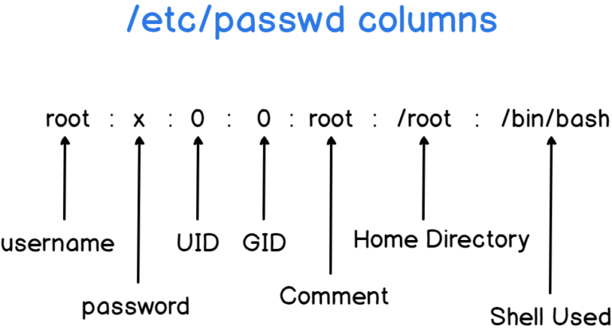

## Get Users
```sh
cat /etc/passwd
```
or
```sh
getent passwd
```
- As a reminder, the getent command retrieves entries from **Name Service Switch databases**.
- The Name Service Switch is a Unix utility that retrieves entries from a set of different data sources such as **files, LDAP, a DNS server or a Network Information Service**.
- The list of all the data sources available can be read from the **`nsswitch.conf`** file located at `/etc`.


To filter only username
```sh
cat /etc/passwd | awk -F: '{print $1}'
```
or
```sh
getent passwd | awk -F: '{print $1}'
```

## List Connected Users on your Linux host

```sh
who
```
or
```sh
users
```

## Get Group

```sh
cat /etc/group
```
or 
```
getent group
```


To get only group name
```sh
cat /etc/group | awk -F: '{print $1}'
```

## List Groups for the current user

```sh
groups
```
